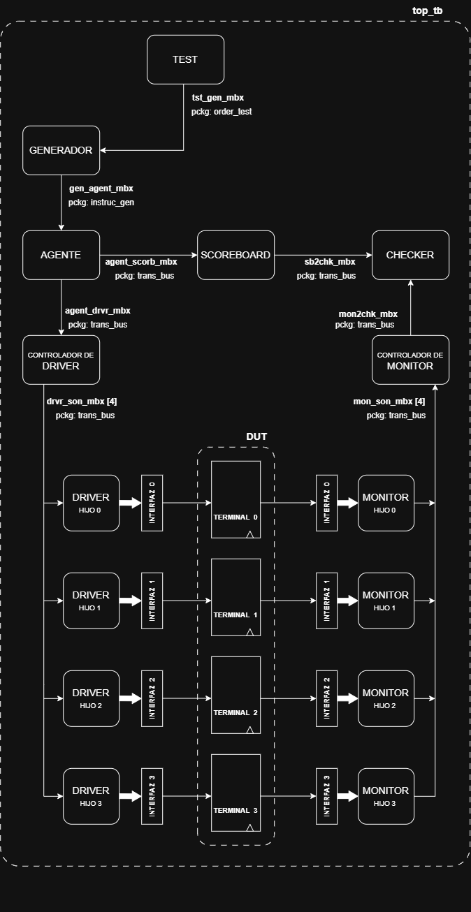

# VFCI-Proyecto-1

**Curso:** Verificación Funcional de Circuitos Integrados (EL5811)  
**Institución:** Instituto Tecnológico de Costa Rica (ITCR)  
**Semestre / Año:** II Semestre 2026  


## Descripción del Proyecto

Este repositorio contiene el desarrollo del **Primer Proyecto** para el curso **Verificación Funcional de Circuitos Integrados (EL5811)**. El proyecto comprende el diseño e implementación de un ambiente de verificación con un esquema de aleatorización controlada en capas. El mismo se detalla en el siguiente diagrama.




## Integrantes

| Nombre | Carné |
| :--- | :--- |
| **Pablo Elizondo Espinoza** | 2023396053 |
| **José Eduardo Tencio Solano** | 2021079387 |


##  Estructura del Repositorio

```text
VFCI-Proyecto-1/
├── doc/                  # Documentación del proyecto
├── src/                  # Código fuente del Diseño Bajo Prueba (DUT)
├── tb/                   # Entorno de Verificación / Testbench 
├── sim/                  # Scripts de simulación, archivos de log/waveforms
├── README.md             # Archivo principal de descripción
└── .gitignore            # Archivos e itinerarios ignorados por Git
```
